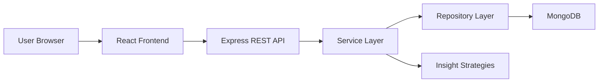

# Architecture Documentation

## System Design

FinanceFlow uses a monorepo with separate backend and frontend applications. The backend exposes REST endpoints for authentication, transactions, dashboards, and insights. The frontend consumes those endpoints through a dedicated API client and presents the data in a responsive dashboard.

## High-Level Architecture



## Folder Structure

```text
backend/src/
├─ config/         # environment and database setup
├─ controllers/    # HTTP adapters
├─ domain/         # repository contracts and shared domain constants
├─ middleware/     # auth and error handling
├─ models/         # mongoose schemas
├─ repositories/   # MongoDB data access implementations
├─ routes/         # REST route definitions
├─ services/       # business logic
├─ strategies/     # insight generation strategies
└─ utils/          # date, token, error helpers

frontend/src/
├─ api/            # axios client
├─ app/            # router and shell
├─ components/     # reusable UI and charts
├─ features/       # auth and dashboard pages
├─ hooks/          # shared hooks
└─ styles/         # global styling
```

## Design Patterns Used

### Repository Pattern

- Abstract contracts live in `src/domain/repositories`.
- Mongo implementations live in `src/repositories`.
- Services depend on repository abstractions rather than raw database access.

### Strategy Pattern

- Each rule-based insight is isolated in `src/strategies/insights`.
- `InsightService` executes the strategies as interchangeable behaviors.
- New financial advice rules can be added without changing existing rule implementations.

### Factory Pattern

- `ServiceFactory` centralizes dependency wiring.
- Controllers receive ready-to-use services without handling repository or strategy construction.

## Security Design

- Passwords are hashed with `bcryptjs`.
- JWTs protect private endpoints.
- Request payloads are validated with `express-validator`.
- Access control is enforced by matching `userId` on transaction queries.

## Scalability Considerations

- Service and repository separation supports future migration to other data stores.
- Insight strategies can evolve into scheduled jobs later without changing controller contracts.
- The frontend is route-split and build-ready with Vite for fast delivery.
