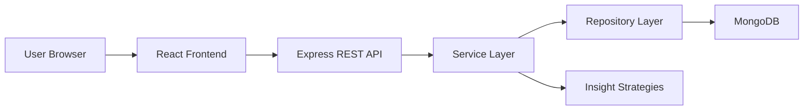

# Architecture Documentation

## System Design

FinanceFlow uses a monorepo with separate backend and frontend applications. The backend exposes REST endpoints for authentication, transactions, dashboards, and insights. The frontend consumes those endpoints through a dedicated API client and presents the data in a responsive dashboard.

## High-Level Architecture



## Folder Structure

```text
backend/src/
├─ config/         # environment and database setup
├─ constants/      # transaction categories and constants
├─ controllers/    # HTTP adapters
├─ middleware/     # auth, error handling, and validation
├─ models/         # mongoose schemas
├─ routes/         # REST route definitions
├─ services/       # business logic
├─ utils/          # helpers (asyncHandler, password hashing, JWT, response formatting, date utilities)
└─ validators/     # request validation schemas

frontend/src/
├─ api/            # axios client
├─ app/            # router and shell
├─ components/     # reusable UI and charts
├─ features/       # auth and dashboard pages
├─ hooks/          # shared hooks
└─ styles/         # global styling
```

## Design Patterns Used

### Service Pattern

- Services encapsulate business logic for authentication, transactions, dashboard, and insights.
- Controllers delegate to services and never contain direct database logic.
- Services are injected into controllers to support testability.

### Middleware Pipeline

- Request validation middleware in `src/middleware/validation.js`.
- Authentication middleware in `src/middleware/auth.js` protects private routes.
- Global error handler in `src/middleware/global-error-handler.js` catches and formats errors.

### Utility Helpers

- Password utilities: `hashPassword`, `comparePassword` for secure authentication.
- JWT utilities: `generateToken`, `jwt` for token generation and verification.
- Response helpers: Standardized response formatting.
- Async handler: Wraps async controllers to catch errors automatically.

## Security Design

- Passwords are hashed with `bcryptjs` using `hashPassword` and `comparePassword` utilities.
- JWTs protect private endpoints through `auth` middleware.
- Request payloads are validated in `middleware/validation.js` using validator schemas.
- Global error handler sanitizes error responses and prevents information leakage.
- Access control is enforced by matching `userId` on transaction queries.

## Scalability Considerations

- Service and repository separation supports future migration to other data stores.
- Insight strategies can evolve into scheduled jobs later without changing controller contracts.
- The frontend is route-split and build-ready with Vite for fast delivery.
