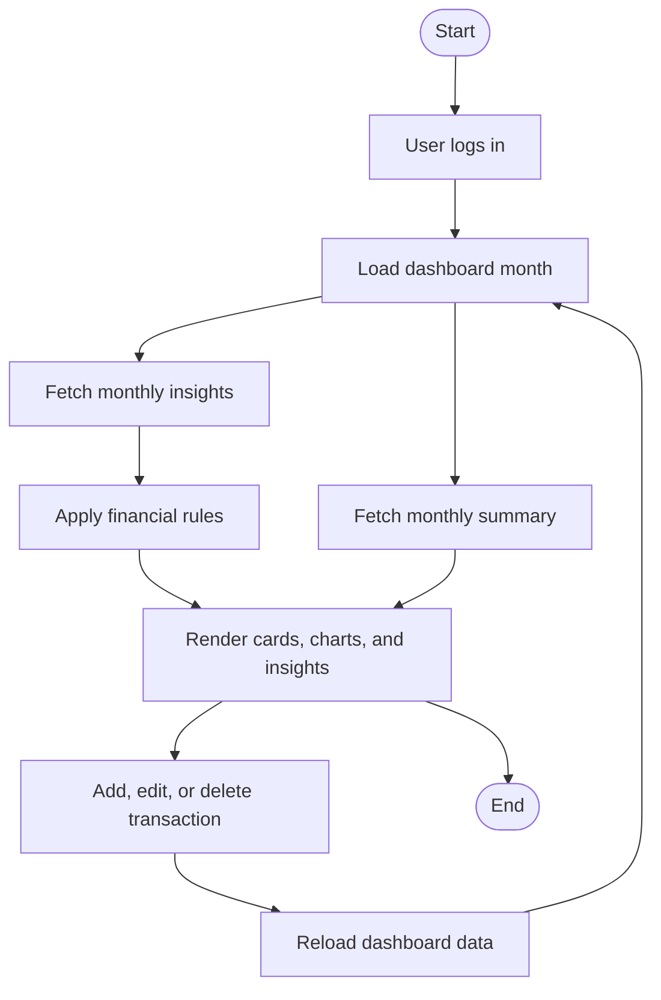

# Activity Diagram

```mermaid
flowchart TD
  Start([Start])
  Login["User logs in"]
  Dashboard["Load dashboard month"]
  FetchSummary["Fetch monthly summary"]
  FetchInsights["Fetch monthly insights"]
  Analyze["Apply financial rules"]
  Render["Render cards, charts, and insights"]
  Manage["Add, edit, or delete transaction"]
  Refresh["Reload dashboard data"]
  End([End])

  Start --> Login --> Dashboard
  Dashboard --> FetchSummary
  Dashboard --> FetchInsights
  FetchInsights --> Analyze --> Render
  FetchSummary --> Render
  Render --> Manage --> Refresh --> Dashboard
  Render --> End
```
