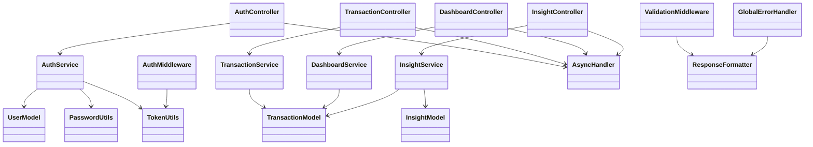

# Class Diagram

```mermaid
classDiagram
  class AuthController
  class TransactionController
  class DashboardController
  class InsightController

  class AuthService
  class TransactionService
  class DashboardService
  class InsightService

  class UserModel
  class TransactionModel
  class InsightModel

  class AuthMiddleware
  class ValidationMiddleware
  class GlobalErrorHandler

  class PasswordUtils
  class TokenUtils
  class AsyncHandler
  class ResponseFormatter

  AuthController --> AuthService
  AuthController --> AsyncHandler
  TransactionController --> TransactionService
  TransactionController --> AsyncHandler
  DashboardController --> DashboardService
  DashboardController --> AsyncHandler
  InsightController --> InsightService
  InsightController --> AsyncHandler

  AuthService --> UserModel
  AuthService --> PasswordUtils
  AuthService --> TokenUtils
  TransactionService --> TransactionModel
  DashboardService --> TransactionModel
  InsightService --> TransactionModel
  InsightService --> InsightModel

  AuthMiddleware --> TokenUtils
  ValidationMiddleware --> ResponseFormatter
  GlobalErrorHandler --> ResponseFormatter
```
