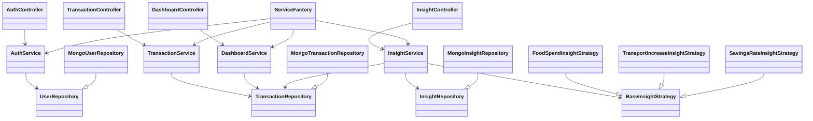

# Class Diagram

```mermaid
classDiagram
  class AuthController
  class TransactionController
  class DashboardController
  class InsightController

  class AuthService
  class TransactionService
  class DashboardService
  class InsightService
  class ServiceFactory

  class UserRepository
  class TransactionRepository
  class InsightRepository

  class MongoUserRepository
  class MongoTransactionRepository
  class MongoInsightRepository

  class BaseInsightStrategy
  class FoodSpendInsightStrategy
  class TransportIncreaseInsightStrategy
  class SavingsRateInsightStrategy

  AuthController --> AuthService
  TransactionController --> TransactionService
  DashboardController --> DashboardService
  InsightController --> InsightService

  AuthService --> UserRepository
  TransactionService --> TransactionRepository
  DashboardService --> TransactionRepository
  InsightService --> TransactionRepository
  InsightService --> InsightRepository
  InsightService --> BaseInsightStrategy

  MongoUserRepository --|> UserRepository
  MongoTransactionRepository --|> TransactionRepository
  MongoInsightRepository --|> InsightRepository
  FoodSpendInsightStrategy --|> BaseInsightStrategy
  TransportIncreaseInsightStrategy --|> BaseInsightStrategy
  SavingsRateInsightStrategy --|> BaseInsightStrategy
  ServiceFactory --> AuthService
  ServiceFactory --> TransactionService
  ServiceFactory --> DashboardService
  ServiceFactory --> InsightService
```
