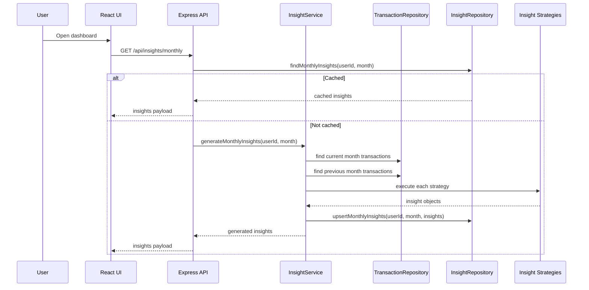

# Sequence Diagram

```mermaid
sequenceDiagram
  participant User
  participant UI as React UI
  participant API as Express API
  participant Service as InsightService
  participant Repo as TransactionRepository
  participant Cache as InsightRepository
  participant Rule as Insight Strategies

  User->>UI: Open dashboard
  UI->>API: GET /api/insights/monthly
  API->>Cache: findMonthlyInsights(userId, month)
  alt Cached
    Cache-->>API: cached insights
    API-->>UI: insights payload
  else Not cached
    API->>Service: generateMonthlyInsights(userId, month)
    Service->>Repo: find current month transactions
    Service->>Repo: find previous month transactions
    Service->>Rule: execute each strategy
    Rule-->>Service: insight objects
    Service->>Cache: upsertMonthlyInsights(userId, month, insights)
    Service-->>API: generated insights
    API-->>UI: insights payload
  end
```
