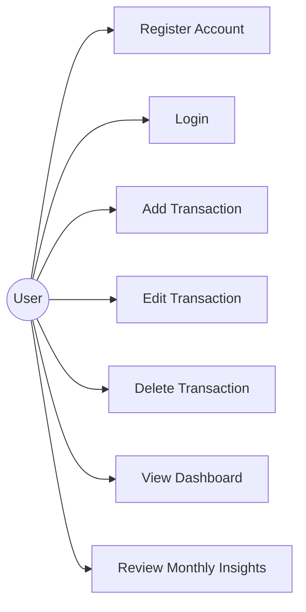

# Use Case Diagram

```mermaid
flowchart LR
  User((User))
  Register["Register Account"]
  Login["Login"]
  AddTransaction["Add Transaction"]
  EditTransaction["Edit Transaction"]
  DeleteTransaction["Delete Transaction"]
  ViewDashboard["View Dashboard"]
  ViewInsights["Review Monthly Insights"]

  User --> Register
  User --> Login
  User --> AddTransaction
  User --> EditTransaction
  User --> DeleteTransaction
  User --> ViewDashboard
  User --> ViewInsights
```
